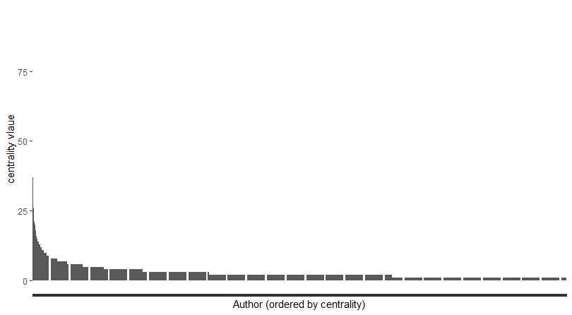
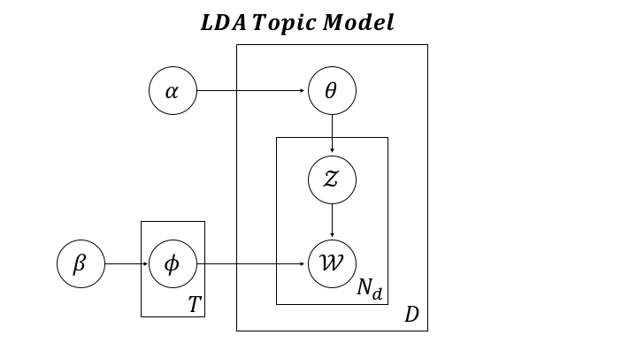
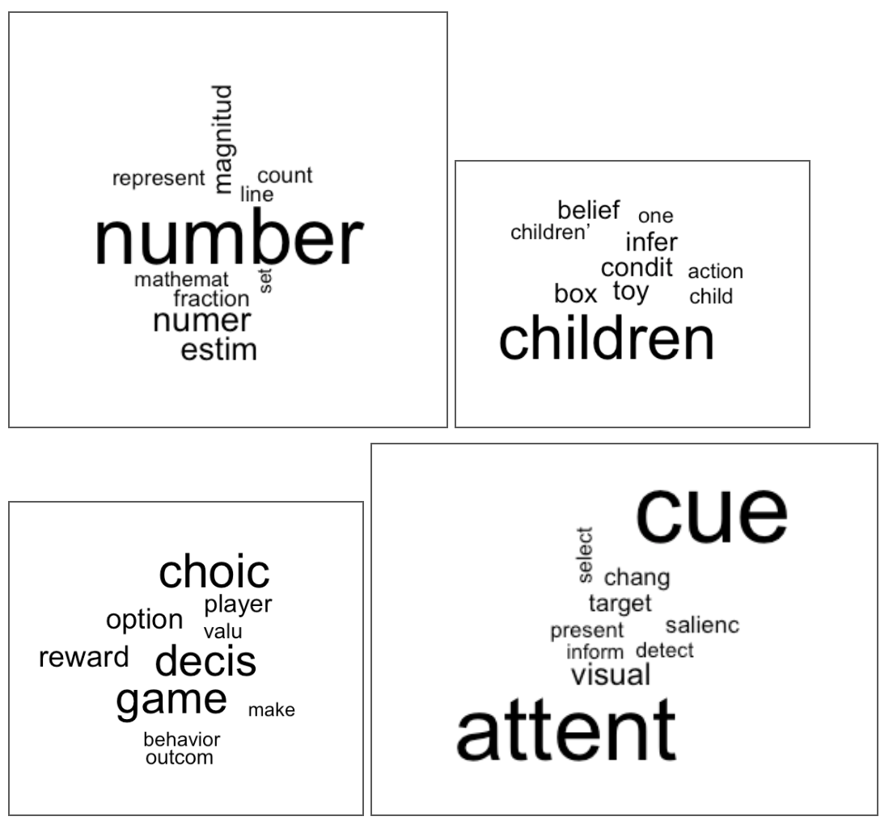
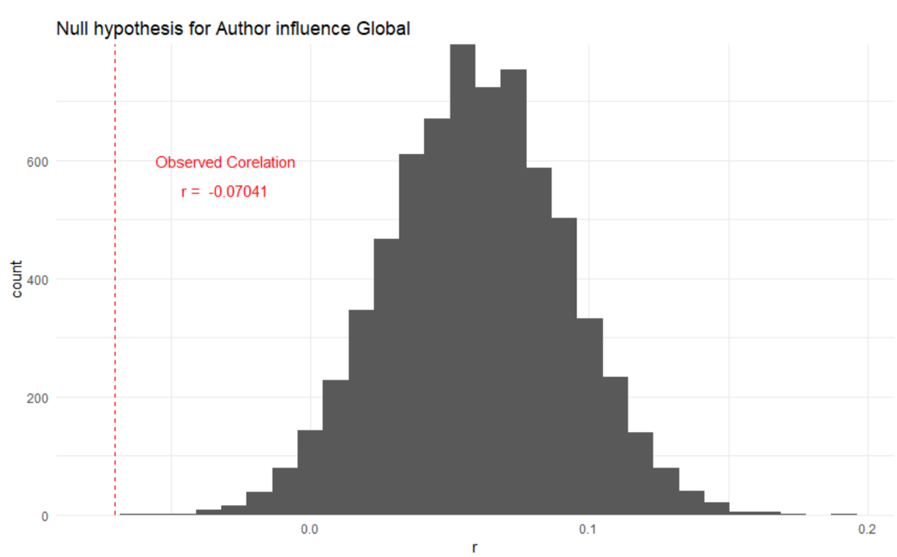
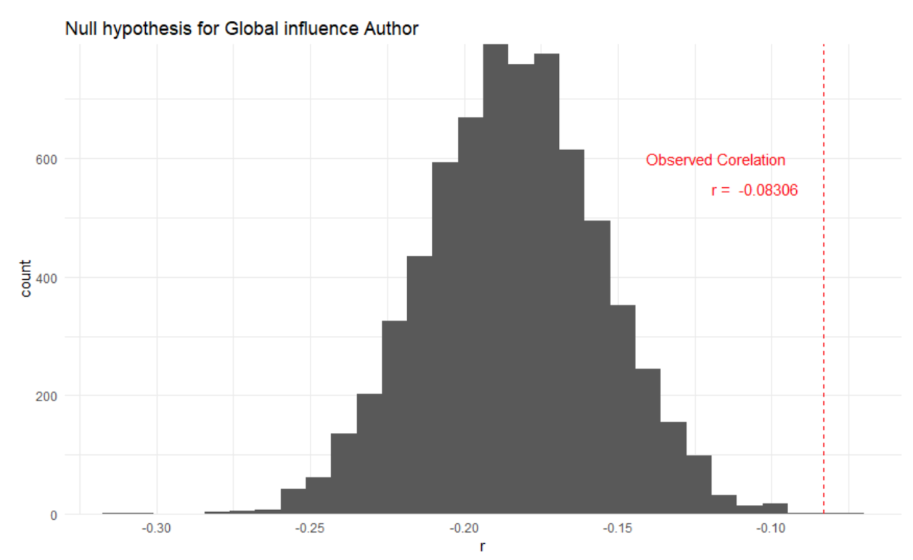

```{r setup, include=FALSE}
knitr::opts_chunk$set(echo = TRUE)
```

```{r message=FALSE, warning=FALSE}
library(tidyverse)
library(Matrix)
source("networkCentralityFunctions.R")
source("topicSpaceVectorProjectionFunctions.R")
authorCounts <- read_csv("author_net.csv")
topic.df.50 = read_csv("topic_dist_fulltext_50.csv")
H0 = read_csv('H0.csv')
```


# Introduction #
Trends in research interest amongst scientific fields are constantly in flux. Research topics that were once popular no longer garner the same attention, and topics that were recently unheard of suddenly skyrocket to the forefront of the field. How do individual researchers relate to these shifts in topic popularity? Do they motivate these changes or are they subjected to the influence of such changes? In particular, how do the research interests of critical scientists interact with the research interests of the field as a whole? This project looks to answer these questions and to ultimately understand how individual authors central to the field might drive shifts in topic popularity, thereby influencing the behavior of the broader scientific community. We focus our attention on research topic changes within the field of cognitive science by generating and analyzing a corpus of papers from the proceedings of the annual Cognitive Science Society Conference (CogSci). First, we build a co-authorship network to measure centrality for each author in the corpus and fit a topic model to the full text of the papers in the corpus. We then apply the network and topic models to examine whether authors more central to the network initiate field-wide shifts in research interests.

To assess the influence of individual authors on the behavior of the scientific community, we construct an undirected, unweighted graph using the authors of papers in our CogSci corpus. In the graph, each individual author is a node and the co-publications between authors define the edges between nodes. This co-authorship network intends to capture the connections between authors and can be used to quantify the influence of individual authors. We compare several graph theoretic measures centrality, which computes the connectedness of individuals within a network, to approximate the “influence” of particular authors. 

To assess changes in research interest in the field, we use a topic model based on the principles of Latent Dirichlet Allocation (LDA, see Figure 5). The introduction of LDA, a generative statistical model for natural language processing, allowed for the efficient discovery and classification of unique topics from large datasets (Blei, Ng, & Jordan, 2003). Subsequent research into topic models has primarily focused on utilizing and improving LDA based models. Griffiths & Steyvers (2004) extended the standard LDA topic model by incorporating document information, and Rosen-Zvi, Griffiths, Steyvers & Smyth (2004) further expanded the model by incorporating author information. This allowed researchers to model papers as sampling from the topic distributions of multiple authors instead of sampling from a simple Dirichlet prior on topic distributions over documents. More recently, variants of topic models have been used to characterize trends in research within the field of cognitive science; however, these models do not attempt to explore any causal drivers of such research trends (Cohen Priva & Austerweil, 2015; Rothe, Rich, & Li, 2018). Our study demonstrates a first-pass attempt at deriving some of the potential causal factors that influence field-wide trends in research interests.

Our author graph and topic model form the basis for hypotheses about the relationship between author centrality and changes in topic distribution by authors and the field as a whole. To operationalize these hypotheses, we first calculate vector differences in topic space among authors and the field year over year. We then examine the directionality and magnitude of author topic vectors projected onto field-wide topic vectors and vice versa. The intuition behind this approach is that insofar as the topic distribution of the field follows particularly influential authors, this should be reflected in the directionality changes in the field’s topic vector when compared to the topic vectors for those authors. To our knowledge, this is the first attempt at quantitatively establishing the changes in topic interest of particular authors in relation to the field and vice versa. 


# Data #

We developed a novel corpus of CogSci papers that consists of the title, authors, abstracts, full text, and year of conference papers from 2000 to 2018. Original texts were hosted by two websites: eScholarship and MindModeling. To extract the data from the web, we used a number of Python libraries, namely the web scraping library Beautiful Soup (bs4), a PDF-to-text converter (pdfminer), a URL handling module (urllib), and a regular expressions handling library (re). After data extraction, we processed the raw text in R. This involved removing irrelevant text (e.g. cover pages, text appearing before the abstract, etc.), removing punctuation, non-ASCII characters, escape characters, and other text cleaning tasks. In our final analysis, we excluded the 13.70% of the papers for which we were missing the corresponding full text. Our final data set included 9,165 papers and 11,312 unique authors.

Our analysis required careful mapping of research papers to their corresponding authors, yet collecting data from multiple websites with different formatting led to lack of systematicity in author names. One issue was that there were multiple name entries for the same author (e.g. Joshua Tenenbaum, Joshua B. Tenenbaum, Josh Tenenbaum). Another related issue, which we have dubbed the "*Kim quandary*", is that an author’s last name often failed to act as a unique identifier. This was especially problematic for popular surnames used by a plethora of authors (e.g. Kim, Smith, Williams). To cope with these issues we resorted to identifying authors by last name and first initial (e.g. J Tenenbaum, E Vul), which although not perfect, certainly reduces the impact of the *Kim quandary*.

The scale of CogSci has grown over the last few years and Figure 1 demonstrates this general upward trend. Furthermore, there are several leading authors in the field. The publications of these leaders increase over the years as visualized in Figure 2.

```{r papersByYear, message=FALSE, warning=FALSE, fig.cap="**Figure 1: The count of CogSci papers by year (removing papers missing the full text).**"}
topic.df.50 %>%
  group_by(year) %>%
  summarise(count = n()) %>%
  ggplot(aes(x=year, y=count)) +
  geom_line() +
  scale_x_continuous(limits=c(1999,2020)) +
  scale_y_continuous("count of papers") +
  theme_minimal()
```

```{r leadAuths, message=FALSE, warning=FALSE, fig.cap="**Figure 2: The top 6 most published authors (and our sovereign leader, Sir E Vul) and their proportion of contribution out of all CogSci papers contributed for a given year.**"}
byAuth <- transform_authorAbbr(topic.df.50) %>%
  mutate(author=strsplit(authors, ", ")) %>%
  unnest(author) %>%
  select(author, title, year)

topAuth <- authorCounts %>%
  top_n(6,n) %>%
  .$authorAbbr

byAuth %>%
  group_by(year, author) %>%
  summarise(count = n()) %>%
  ungroup() %>%
  group_by(year) %>%
  mutate(prop = count/n()) %>%
  filter(author %in% topAuth | author == "E Vul") %>%
  ggplot(aes(x=year, y=prop, colour=author)) +
  geom_smooth(se=F) +
  scale_x_continuous(limits=c(1999,2020)) +
  scale_y_continuous("proportion of papers") +
  theme_minimal()
```


# Methods #

### Author Network Centrality ###


The concept of centrality, which is often used to analyze the connectedness of an individual in various kinds of social networks, is well suited to analyzing a co-authorship network. To make the co-authorship graph tractable, we assume that pairs of authors with multiple co-publications have only one edge connecting them. 

We initially considered three measures of centrality: degree centrality, betweenness centrality, and closeness centrality. These measures were chosen based on previous research pertaining to the behavior of social networks (Landher, Friedl, & Heidemann, 2010). Calculations of centrality were performed using the R package igraph. A graph with n nodes can be represented as an adjacency matrix, $A = (a_{ij}) \in \{0;1\}^{n×n}$, where the value of $a_{ij} = 1$ just in case there is an edge connecting nodes i and j. Properties of the graph can be derived from the adjacency matrix.

Degree centrality (DC) $\sigma_D$ is the simplest centrality measure that enumerates the nodes that a given node is directly connected to. Formally, using the adjacency matrix we define DC as:

$$\sigma_D(x) = \sum^n_{i=1} a_{ix}$$

In the co-authorship network, this measure can be interpreted as the number of authors on which a given author has direct influence; more influential authors will have a higher DC.

Closeness centrality (CC) is defined as the minimum number of edges to travel from one node to another. The distances between a given node and all other nodes are summed, and the inverse of this total distance gives CC. In the co-authorship network, CC can be interpreted as how productively an author can spread information through the network of authors; authors who can proliferate information will have a higher CC. 

Betweenness centrality (BC) is defined by how many of the shortest paths between pairs of nodes a given node is located on. In the co-authorship network, we assume that the interaction between two authors is facilitated by the authors in between them. We can interpret BC as the influence that an author has on the communications between other authors in the network.

Using our measures of centrality we found the top 10 authors for each of the measures (Table 1). All three measures agree on the top two authors, but differentiate between authors ranked lower, reflecting potential differences in the ways lower ranked authors contribute to the field.

| rank | betweenness | closeness | degree |
|--------|----------|---------|----------|
| 1 | J Tenenbaum | J Tenenbaum | J Tenenbaum |
| 2 | T Griffiths | T Griffiths | T Griffiths |
| 3 | R Goldstone | R Goldstone | N Goodman |
| 4 | D Gentner | T Gureckis | D Gentner |
| 5 | R Dale | N Goodman | M Frank |
| 6 | C Yu | C Yu | R Goldstone |
| 7 | N Chater | M Jones | R Dale |
| 8 | N Goodman | L Smith | C Yu |
| 9 | B Love | B Love | T Gureckis |
| 10 | L Smith | D Gentner | J Hu |
**Table 1: Top authors by each of the primary centrality rankings**


```{r eval = FALSE}
topic.df.50.processed = suppressWarnings(topic.df.50 %>% transform_authorAbbr())

author_net = suppressWarnings(getAuthorList(topic.df.50.processed))

centrality = writeAuthorNet(author_net) # NB: this takes a few minutes

```
We used the R package visNetwork to generate a visualization of the co-authorship network shown in Figure 3. This illustration reveals a problem with our network, which is the fact of multiple subgraphs surrounding the main graph, making the network disconnected. The CC and BC measures rely on the graph being connected; however, DC is measurable regardless of the node’s connection to the main graph. DC, while unable to connect author islands, accurately reflects an individual’s influence irrespective of them being connected to the primary network - a common failing of the other suggested centrality measures. Therefore, in our final analysis, we only considered DC as the measure of centrality.

```{r eval = FALSE, centrality_graph,  message=FALSE, warning=FALSE}
centrality %>% 
  filter(CM == 'degree') %>% 
  arrange(desc(measure)) %>%
  select(-id,-CM) %>%
  mutate(rank = dense_rank(desc(measure)))%>%
  ggplot(aes(x=reorder(factor(label),rank),y=measure))+
  geom_bar(stat='identity')+
  xlab('Author (ordered by centrality)')+
  ylab('centrality vlaue' )+
  theme(axis.text.x = element_blank())
```




### Topic Model ###


Our hypothesis about the impact of author centrality on the research interest trajectory in the field requires the ability to characterize the research topics that dominate the works of particular authors and the field as a whole. This is accomplished through the use of a topic model fit to the full text of the papers in our corpus, allowing us to map papers and authors into a high dimensional “topic space”. We use the Structural Topic Model (stm) package in R, which provides out-of-the-box tools to implement LDA-based topic models for text documents. More advanced models can be implemented with stm by including covariates such as author(s) or date as part of the generative process for topic and word distributions (Roberts, Steward, & Tingley, 2015). This package is a powerful tool for exploring topic dynamics in our corpus of CogSci papers.

We use the standard topic modeling features of stm (without relying on covariate information) to fit a topic model to our data. The model begins by pre-processing the documents to remove punctuation, stopwords, and numbers, as well as high frequency items. Using the full text from 9,165 CogSci papers (after initial pre-processing) published between 2000 and 2018, with around 20,000 unique lemmas, we fit a topic model with 50 and 100 topics. Qualitative analysis of the most probable words in each topic confirmed that the topic divisions are meaningful (Figure 6). Further quantitative assessment of topic fit is possible through a number of different approaches (see for example Rosen-Zvi et al. 2004) but was not pursued here. Rather, we took the fact that topic divisions separated likely words in a meaningful way as sufficient for exploring the relationship between author centrality and changes in topic distributions year over year. The output of the model is an $n$ Documents by $t$ Topics matrix where each cell $i,j$ is the proportion of topic $j$ in paper $i$ fit by the model. With this, we can position a given paper in topic space or aggregate the topic vectors for a set of papers (e.g. belonging to a particular author or a particular year) for comparison across years. 




### Field Dynamics ###
We were unable to find a well established metric that would allow us to calculate an author's influence on the field given their position in topic space. Therefore, in order to assess how centrality measures relate to the dynamics of the topic space of the field, we contrived a novel measure of influence by comparing the movement of author and global topic vectors over time.

For each paper in our data set, the topic model outputs a vector of weights on each topic component that define that paper’s position in topic space. Since we are interested in the temporal dynamics of positions in topic space, we aggregate the papers into a global topic vector for each year. We also find an author’s position in topic space in each year by aggregating the topic vectors of their papers in that year (if they have any). This process results in a set of vectors in topic space: one *global topic position vector* for each year, and a set of *author topic position vectors* for each year that the given author published in. 

For each author, we find the difference between their topic position vector in a given year and the global topic position vector. This *global-author topic difference vector* represents how a particular author differs from the field as a whole in a given year  (Figure 7i). A second difference vector is calculated between years to represent changes in the position in topic space, both for the global topic distribution and for an author’s topic distribution. We expect the rate of broad topic interest change in the field to be relatively slow; therefore, we calculate the vector difference every third year (e.g., 2003 topic position vector minus 2000 topic position vector). The change in topic space position is calculated for the field as a whole (*global topic change vector*) (Figure 7ii) and for individual authors (*author topic change vector*) (Figure 7iii). The *global topic change vector* represents how the topics in the field change over time. The *author topic change vector* represents how an author’s interest in different topics changes over time. The *global-author topic difference vectors* and the topic change vectors are used to calculate our dependent measure.

The projection of the *global topic change vector* onto the *global-author topic difference vector* will tell us the amount the field moves along the direction that a particular author differs from the field (Figure 7iv).  This projection can be thought of as how much an author influences the field: does the field move towards or away from the author in topic space and by how much? 

The projection of the *author topic change vector* onto the *global-author topic difference vector* will tell us the amount the *author* moves along the direction that they differ from the field (Figure 7iv). This projection can be thought of as how much an author is *influenced by* the field: does an author move towards or away from the field in topic space and by how much? 

We find these two projection vectors in all the years that the author is present and take their average. This produces two measures for each author each year: (1) a representation of the amount the author influences the field and (2) a representation of the amount the field influences the author.  

![**Figure 7: Depiction of how the dependent measure is calculated via vector projection. (i) The *global-author topic difference vector*: how a particular author differs from the field as a whole in a given year (ii) The change in topic space position calculated for the field as a whole (*global topic change vector*) (iii) The change in topic space position calculated for individual authors (*author topic change vector*) (iv) The projection of the *global topic change vector* onto the *global-author topic difference vector*, and the projection of the *author topic change vector* onto the *global-author topic difference vector*.**](dynamics_full.png)


```{r eval = FALSE, get_centrality_subset}
author_net_filtered = author_net %>%
  group_by(authorAbbr) %>%
  summarise(n = n()) %>%
  filter(n > 1) %>%
  ungroup()

centrality_subset = centralityQuantile(centrality, q = c(0,1)) %>% filter(label %in% author_net_filtered$authorAbbr)
```

Before calculating the topic dynamics measure, we removed authors from the data who had only one publication. Our measure depends on change in an author’s topic distribution over multiple years, and cannot be found with a single observation. While the author’s influence on the global projection can still be calculated for authors with only one publication, we chose not to include them so that our correlational measures for *author influence global* and *global influence author* were calculated over the same authors and had the same number of observations. Authors with single publications were still included when calculating our topic model and centrality measures in order to provide maximally accurate topic distribution and centrality information. 

```{r eval = FALSE, create_sparse_matrices}
authors = centrality_subset %>%
  pull(label) %>%
  unique()

papers = topic.df.50$title

years = topic.df.50 %>%
  pull(year) %>%
  unique() %>%
  sort()

author.mat = Matrix(0, 
                    nrow = length(papers),
                    ncol = length(authors),
                    dimnames = list(papers, as.character(authors)))

for (col in seq(1:dim(author.mat)[2])) { # This takes 3 mins
  author.lookup = colnames(author.mat)[col]
  author.grep = as.vector(unlist(sapply(author.lookup, function(author.lookup){return(grep(author.lookup, topic.df.50$authors, value = TRUE))})))
  author.rows = topic.df.50 %>%
    filter(authors %in% author.grep) %>%
    select(title)
  if (sum(rownames(author.mat) %in% author.rows$title) > 0) {
    author.mat[rownames(author.mat) %in% author.rows$title, colnames(author.mat)[col]] = 1
  }
}


year.mat = Matrix(0,
                  nrow = length(papers),
                  ncol = length(years),
                  dimnames = list(papers, as.character(years)))

for (col in seq(1:dim(year.mat)[2])) { # This takes ~1s
  year.lookup = colnames(year.mat)[col]
  year.rows = topic.df.50 %>%
    filter(as.character(year) == year.lookup) %>%
    select(title)
  year.mat[rownames(year.mat) %in% year.rows$title, colnames(year.mat)[col]] = 1
}
```

We use sparse matricies for year and author to facilitate computation.

```{r eval = FALSE, calculate_dependent_measure}
global_topic.50 =  topic.df.50 %>% 
  globalTopicDistByYear(., 50) %>% # long format with topic, year, probability (global average of each topic by year)
  group_by(topic) %>% 
  mutate(diff = lead(prob,3) - prob)

# NB this takes several minutes
author_influence.50 = centrality_subset %>%
  pull(label) %>%
  unique() %>%
  mapply(authorsInfluence, ., MoreArgs = list(topic.df = topic.df.50, N = 50,
                                              author.matrix = author.mat, year.matrix = year.mat,
                                              global_topic = global_topic.50))
```

This produces the dependent measure which we will further manipulate in the results.

# Results #


```{r eval = FALSE, Calculate_cor}
author_influence.cors = data.frame(t(author_influence.50))%>%
  inner_join(centrality_subset, by = c("author" = "label"))%>%
  filter(global_influence_author != 'NaN', author_influence_global != 'NaN')%>%
  mutate(author_influence_global = as.numeric(as.character(author_influence_global)),
         global_influence_author = as.numeric(as.character(global_influence_author)))%>%
  do(cor.global.author = cor.test(.$global_influence_author,.$author_influence_global),
            cor.global.influence.author.centrality = cor.test(.$global_influence_author,log(.$measure)),
            cor.author.influence.global.centrality = cor.test(.$author_influence_global,log(.$measure)))
```


To test the hypothesis that author centrality is related to changes in topic space across the field, we correlate each author’s log-transformed degree centrality with that author’s *author influence global* projection as well as their *global influence author* projection. 

```{r eval = FALSE, cor_test_results}
cor_test_gia = author_influence.cors$cor.global.influence.author[[1]]
cor_test_aig = author_influence.cors$cor.author.influence.global[[1]]
```

These correlations are significantly different from zero for both the author influence global and global influence author projections (r = -0.07041, p = 0.03, r = -0.0831, p = 0.0104), suggesting that increases in an author’s degree centrality relates to changes in the direction of the field relative to that author in topic space. 

Because of the way we calculated our dependent measure, we expect that if the author does not have an influence on the global topic space then the projection of the global change vector will be large and positive. Likewise, if the change in global topic space is in the direction of how the author differs from the field, then the projection of the global change vector will be small and/or negative. Conversely, if the global topic space has an influence on an author, then the projection of the author change vector will be positive such that the author moved towards the global position in topic space, and if the global topic space has no influence on the author then the projection of the author change vector will be negative.

Notably, these correlations are significant for author and global difference vectors calculated on three-year time scales but not for single-year time scales and are not as strong for two-year. Intuitively, this reflects the idea that changes in topic space, particularly for the field as a whole, do not happen instantaneously and to the degree that the work of the field follows particularly influential authors, this likely takes several years. However, future work should provide more quantitative support for this hypothesis.


```{r eval = FALSE, Null_randomization}
indx = sample(1:nrow(author.matrix),nrow(author.matrix))
author.matrix = author.matrix[indx,]
```

The measures that we used to find this correlation are unusual so there is reason to believe that a parametric null hypothesis test is inappropriate. We use a randomization approach to generate a null hypothesis to see whether the link between centrality and topic dynamics is actually significantly different than a correlation generated by chance alone. In order to do this we reassigned the co-authors of papers to new paper titles. This shuffling assumption means that the centrality network will remain the same (the co-authorship connections are unbroken) and that the topic model fit also remains the same (the topic model produced estimates for each paper without consideration of the author). We then calculate our contrived measure of topic dynamics on the randomized data. 

```{r eval = FALSE, NHST}
cor_val_gia = author_influence.cors$cor.global.influence.author[[1]]$estimate
cor_val_aig = author_influence.cors$cor.author.influence.global[[1]]$estimate

pval_giac = (sum(H0$cor.GIAC.cor>cor_val_gia)+1)/(length(H0$cor.GIAC.cor)+2)
pval_giac*2

pval_aigc = (sum(H0$cor.AIGC.cor>cor_val_aig)+1)/(length(H0$cor.AIGC.cor)+2)
pval_aigc = (1-pval_aigc)*2

```

Evaluated against the non-parametric null distribution generated using resampling methods described above, the correlation between author centrality and topic change projections remains significant (p = 0.0012 for global influence author projections; p = 0.0003 for author influence global projections). 


```{r eval = FALSE, NHST_figures}
H0 %>% 
  ggplot(aes(x=cor.GIAC.cor))+
  geom_histogram()+
  geom_vline(col = 'red', linetype = 2,xintercept = cor_val_gia)+
  annotate('text',col = 'red',size = 4,label = 'Observed Corelation', x= -0.035+cor_val_gia, y = 600)+
  scale_y_continuous(expand = c(0,0))+
  theme_minimal()+
  xlab('r')+
  ggtitle('Null hypothesis for Global influence Author')


H0 %>% 
  ggplot(aes(x=cor.AIGC.cor))+
  geom_histogram()+
  geom_vline(col = 'red', linetype = 2,xintercept = cor_val_aig)+
  annotate('text',col = 'red',size = 4,label = 'Observed Corelation', x= -0.035+cor_val_aig, y = 600)+
  scale_y_continuous(expand = c(0,0))+
  theme_minimal()+
  xlab('r')+
  ggtitle('Null hypothesis for Author influence Global')
```





# Discussion #
To identify how individual authors influence the behavior of the broader scientific community, we generated a topic model and a co-authorship network from two large datasets of empirical papers and abstracts from the proceedings of the annual Cognitive Science Society Conference. We investigated and compared various measures of centrality to determine the prominence of authors in the broader CogSci community. Because the authorship network was a disconnected graph, we implemented degree centrality as our solitary measure of an author’s connectedness. Degree centrality surmounts the difficulty of determining influence in a disconnected graph and is the most computationally tractable of the measures which facilitated our analysis. 

We subsequently fit a topic model to the full text of the CogSci corpus, which identified qualitatively robust topics based on recurring patterns of words in the text. This allowed us to position publications by particular authors and in particular years in topic space and evaluate the change in author topic and global topic distributions over the span of years. Our hypothesis was that an author’s centrality in the co-authorship network would be correlated with the changes of the broader field in topic space. To evaluate this, we proposed a novel measure which projects the change in authors’ topics year to year and the change in global topics year to year onto a difference vector between individual authors and the global topic distribution. We find significant correlations between an author’s degree centrality and both author and global projections onto the difference vector between author and global topics. This signifies broadly that the movement of the broader field in topic space follows the same directions as highly central authors year over year. To further bolster this correlation, we construct a null distribution by shuffling the authors assigned to papers used in the topic model and co-authorship network, then re-calculating the correlation between author centrality and changes in vector projections. Our findings remain significant when evaluated against the shuffled null distribution with approximately 7,000 samples.

Compared to the null hypothesis that we generated, the correlation we found for author influence global was much more negative than would be expected by random chance. This suggests that with increase in centrality there is a decrease in the value of the projection of the global change vector. In other words, higher degree centrality correlates with having more influence on the topics that are researched in the field.

We also found that the global influence on author was much closer to zero than was expected by our generated null hypothesis. While the correlation is slightly negative, this negative direction is likely due to some bias inherent in the data (all correlations in the null were negative), so we cannot interpret the direction as particularly meaningful. We can interpret from the fact that our correlation was unusually close to zero that the relationship between centrality and global influence on an author does not exist (or if it does, it is very weak). 

Since we used a novel vector analysis to quantify the relationship between author and global topic space, future work includes performing validation tests on this measure in order to provide an unbiased evaluation of the reliability of this measure. Additionally, one issue with the co-authorship network is that the graph has unweighted connections between authors, which fails to account for how the number of publications between two authors reflects the strength of their relationship. Therefore, future studies should also explore the possibility of integrating weighted graphs in measuring centrality. Finally, to allow for more fine tuned modification and optimization of the topic model fit to this data, we plan to generate and fit our own topic model. A natural question is how much these results generalize to data outside of cognitive science. Future work should examine corpora of research papers from other scientific fields to see if these effects generalize. 


# References #

Blei, D., Jordan, M., & Ng, A. Y. (2003). Latent Dirichlet Allocation. *Journal of Machine Learning Research*, 3, 993–1022.

Cohen Priva, U. & Austerweil, J. L. (2015). Analyzing the history of Cognition using Topic Models. *Cognition*, 135, 4-9.

Griffiths, T. L. & Steyvers, M. (2004). Finding scientific topics. *Proceedings of the National Academy of Sciences*, 101(1), 5228-5235.

The igraph core team (2015). Igraph-the network analysis package. Retrieved from https://igraph.org/redirect.html

Roberts, M. E., Stewart, B. M., Tingley, D. (2015). Stm: R Package for Structural Topic Models. Retrieved from cran.r-project.org/web/packages/stm/vignettes/stmVignette.pdf

Rosen-Zvi, M., Griffiths, T., Steyvers, M., & Smyth, P. (2004). Probabilistic author-topic models for information discovery. In *Proceedings of the 2004 ACM SIGKDD International Conference on Knowledge Discovery and Data Mining* - KDD ’04 (p. 306).

Rothe, A., Rich, A. S., & Li, Z.-W. (2018). Topics and Trends in Cognitive Science (2000-2017). In *Proceedings of the 40th Annual Conference of the Cognitive Science Society*, 979–984.


